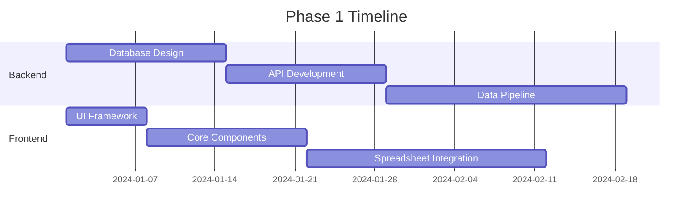

# Product Design Requirements (PDR)
# OpenEquity Research Platform

**Version:** 1.0
**Date:** November 2024
**Status:** Initial Draft
**Product Owner:** CFA Student Initiative
**Document Type:** Product Design Requirements

---

## 1. Executive Summary

### 1.1 Product Vision
Create the world's first comprehensive open-source equity research platform that democratizes professional-grade financial analysis tools while providing native CFA curriculum integration, making institutional-quality research accessible to students, individual investors, and emerging markets professionals.

### 1.2 Mission Statement
To bridge the $20,000+ annual cost barrier of professional financial terminals by providing a free, open-source alternative that combines equity research tools, financial modeling capabilities, CFA study integration, and collaborative features in a single platform.

### 1.3 Success Criteria
- 50,000+ active users within 18 months
- CFA Institute recognition/partnership
- 100+ contributing developers
- 1,000+ financial models in marketplace
- 25+ university adoptions

---

## 2. Product Overview

### 2.1 Product Description
OpenEquity Research is a comprehensive web-based platform combining:
- Professional equity research tools
- Integrated spreadsheet with financial modeling
- Real-time market data integration
- AI-powered analysis capabilities
- CFA curriculum alignment
- Collaborative research features
- Open-source model marketplace

### 2.2 Key Differentiators
| Feature | Bloomberg Terminal | Our Platform | Competitive Advantage |
|---------|-------------------|--------------|----------------------|
| Cost | $24,000/year | Free (Open Source) | 100% cost reduction |
| Spreadsheet | Separate Excel Plugin | Native Integration | Seamless workflow |
| CFA Integration | None | Native | Educational focus |
| AI Analysis | Limited | Advanced NLP/ML | Modern technology |
| Collaboration | Limited | Full Suite | Team-based research |
| Customization | Restricted | Unlimited | Open source flexibility |
| Model Sharing | Not Available | Marketplace | Community-driven |

### 2.3 Target Market
- **Primary:** CFA candidates (300,000+ globally)
- **Secondary:** Finance students (2M+ globally)
- **Tertiary:** Independent researchers, emerging market analysts
- **Extended:** Small investment firms, fintech startups

---

## 3. User Personas

### 3.1 Primary Persona: CFA Level II Candidate
**Name:** Sarah Chen
**Age:** 26
**Role:** Junior Analyst at boutique firm
**Goals:**
- Pass CFA Level II exam
- Build professional modeling skills
- Conduct quality research without expensive tools

**Pain Points:**
- Cannot afford Bloomberg Terminal
- Excel models disconnected from data
- No CFA-specific practice tools
- Limited collaboration with study group

**User Journey:**
1. Signs up for free account
2. Imports study schedule from CFA Institute
3. Uses DCF template for practice
4. Collaborates on mock valuations
5. Tracks progress toward exam

### 3.2 Secondary Persona: University Professor
**Name:** Dr. James Williams
**Age:** 45
**Role:** Finance Professor
**Goals:**
- Teach practical equity research
- Provide hands-on tools to students
- Integrate real market data in coursework

**Pain Points:**
- University budget constraints
- Outdated teaching tools
- Limited real-world applications
- No collaborative platform for class

### 3.3 Tertiary Persona: Independent Investor
**Name:** Raj Patel
**Age:** 34
**Role:** Part-time investor
**Goals:**
- Conduct thorough due diligence
- Build custom valuation models
- Track portfolio performance

---

## 4. Functional Requirements

### 4.1 Core Features - Priority 1 (MVP)

#### 4.1.1 Data Management System
```
Requirements:
- [ ] Import financial statements from SEC EDGAR
- [ ] Parse XBRL format filings
- [ ] Store 10 years historical data
- [ ] Support 5,000+ US equities
- [ ] Real-time quotes (15-min delay acceptable)
- [ ] Automatic data quality checks
```

#### 4.1.2 Financial Analysis Engine
```
Requirements:
- [ ] Calculate 70+ financial ratios
- [ ] Generate common-size statements
- [ ] Perform DuPont analysis
- [ ] Create peer comparisons
- [ ] Industry benchmark integration
- [ ] Trend analysis (5-year minimum)
```

#### 4.1.3 Integrated Spreadsheet
```
Requirements:
- [ ] Full Excel formula compatibility (400+ functions)
- [ ] Import/Export .xlsx files
- [ ] Custom financial formulas (WACC, DCF, etc.)
- [ ] Real-time data linking
- [ ] Collaborative editing
- [ ] Version control
- [ ] Cell-level permissions
```

#### 4.1.4 Valuation Models
```
Requirements:
- [ ] DCF model generator
- [ ] Comparable company analysis
- [ ] Precedent transaction analysis
- [ ] DDM implementation
- [ ] Residual income model
- [ ] Sensitivity analysis
- [ ] Scenario planning
```

### 4.2 Advanced Features - Priority 2

#### 4.2.1 AI/ML Capabilities
```
Requirements:
- [ ] Earnings call transcript analysis
- [ ] Sentiment scoring (management tone)
- [ ] Key risk extraction from filings
- [ ] Anomaly detection in financials
- [ ] Peer group auto-identification
- [ ] Natural language query interface
```

#### 4.2.2 CFA Integration
```
Requirements:
- [ ] Map features to CFA LOS
- [ ] Practice problem generator
- [ ] Mock exam creation
- [ ] Progress tracking
- [ ] Study group formation
- [ ] Formula quick reference
- [ ] Ethics case studies
```

#### 4.2.3 Collaboration Suite
```
Requirements:
- [ ] Shared workspaces
- [ ] Real-time co-editing
- [ ] Comments and annotations
- [ ] Model review workflow
- [ ] Change tracking
- [ ] Permission management
- [ ] Team chat integration
```

### 4.3 Platform Features - Priority 3

#### 4.3.1 Model Marketplace
```
Requirements:
- [ ] Upload custom models
- [ ] Peer review system
- [ ] Quality ratings
- [ ] Usage analytics
- [ ] Fork and customize
- [ ] Version management
- [ ] License selection
```

#### 4.3.2 Mobile Application
```
Requirements:
- [ ] iOS native app
- [ ] Android native app
- [ ] Offline mode
- [ ] Push notifications
- [ ] Touch-optimized spreadsheet
- [ ] Biometric authentication
```

---

## 5. Technical Requirements

### 5.1 Architecture Specifications

#### 5.1.1 Frontend Requirements
```yaml
Framework: Next.js 14+
Language: TypeScript 5.0+
UI Library: React 18+
Styling: Tailwind CSS 3.0+
Spreadsheet: Luckysheet/OnlyOffice
Charts: D3.js + Recharts
State Management: Redux Toolkit
Testing: Jest + React Testing Library
```

#### 5.1.2 Backend Requirements
```yaml
Primary API: Python FastAPI
Secondary: Node.js Express
Database: PostgreSQL 15+
Time-series DB: TimescaleDB
Cache: Redis 7.0+
Search: Elasticsearch 8.0+
Message Queue: RabbitMQ
ML Framework: PyTorch/TensorFlow
```

#### 5.1.3 Infrastructure Requirements
```yaml
Container: Docker
Orchestration: Kubernetes
CI/CD: GitHub Actions
Monitoring: Prometheus + Grafana
Logging: ELK Stack
CDN: CloudFlare
Storage: S3-compatible
Security: OAuth 2.0 + JWT
```

### 5.2 Performance Requirements

| Metric | Requirement | Measurement Method |
|--------|------------|-------------------|
| Page Load Time | < 2 seconds | Lighthouse Score |
| API Response | < 500ms (p95) | APM Monitoring |
| Spreadsheet Calculation | < 1s for 10K cells | Performance Test |
| Concurrent Users | 10,000+ | Load Testing |
| Data Refresh | < 5 seconds | End-to-end Test |
| Uptime | 99.9% | Monitoring |
| Model Save Time | < 2 seconds | User Testing |

### 5.3 Scalability Requirements
```
- Horizontal scaling for API servers
- Database sharding by company ticker
- CDN for static assets
- Microservices architecture
- Event-driven data pipeline
- Auto-scaling based on load
```

### 5.4 Security Requirements
```
Level 1 - Critical:
- [ ] SOC 2 Type II compliance pathway
- [ ] End-to-end encryption for sensitive data
- [ ] Multi-factor authentication
- [ ] Role-based access control (RBAC)
- [ ] API rate limiting
- [ ] SQL injection prevention
- [ ] XSS protection

Level 2 - Important:
- [ ] Audit logging
- [ ] Data anonymization
- [ ] GDPR compliance
- [ ] Regular security audits
- [ ] Vulnerability scanning
- [ ] Penetration testing
```

---

## 6. User Interface Requirements

### 6.1 Design Principles
1. **Clarity:** Financial data must be immediately comprehensible
2. **Efficiency:** Power users need keyboard shortcuts
3. **Flexibility:** Customizable layouts and workflows
4. **Consistency:** Uniform design language throughout
5. **Accessibility:** WCAG 2.1 AA compliance

### 6.2 Key Screens

#### 6.2.1 Dashboard
```
Components:
- Market overview widget
- Watchlist with real-time quotes
- Recent research activities
- CFA study progress
- News feed
- Quick search bar
```

#### 6.2.2 Company Research Page
```
Layout:
┌─────────────────────────────────────┐
│ Header: Ticker | Price | Change     │
├──────────┬──────────────────────────┤
│ Sidebar  │ Main Content Area        │
│          │ - Chart                  │
│ - Overview│ - Financials            │
│ - Financials│ - Ratios             │
│ - Valuation│ - News                │
│ - News   │ - Analysis              │
│ - Filings│                         │
└──────────┴──────────────────────────┘
```

#### 6.2.3 Spreadsheet Interface
```
Features:
- Formula bar with IntelliSense
- Custom ribbon for financial functions
- Data panel for live feeds
- Collaboration sidebar
- Model templates dropdown
- Export options menu
```

### 6.3 Responsive Design Requirements
```
Breakpoints:
- Mobile: 320px - 768px
- Tablet: 768px - 1024px
- Desktop: 1024px - 1920px
- Wide: 1920px+

Critical mobile features:
- Touch-optimized spreadsheet
- Swipe navigation
- Condensed data views
- Offline capability
```

---

## 7. Data Requirements

### 7.1 Data Sources
| Source | Type | Update Frequency | Priority |
|--------|------|-----------------|----------|
| SEC EDGAR | Filings | Real-time | Critical |
| Yahoo Finance | Quotes/Fundamentals | 15-min | Critical |
| Alpha Vantage | Market Data | Daily | High |
| FRED | Economic Data | Daily | High |
| Company Websites | Investor Relations | Weekly | Medium |
| News APIs | News/Sentiment | Real-time | Medium |

### 7.2 Data Schema

#### 7.2.1 Company Master Table
```sql
CREATE TABLE companies (
    ticker VARCHAR(10) PRIMARY KEY,
    name VARCHAR(255) NOT NULL,
    sector VARCHAR(100),
    industry VARCHAR(100),
    market_cap DECIMAL(20,2),
    employees INTEGER,
    founded_year INTEGER,
    headquarters VARCHAR(255),
    website VARCHAR(255),
    description TEXT,
    sic_code VARCHAR(10),
    cik VARCHAR(10),
    exchange VARCHAR(20),
    created_at TIMESTAMP DEFAULT NOW(),
    updated_at TIMESTAMP DEFAULT NOW()
);
```

#### 7.2.2 Financial Statements Table
```sql
CREATE TABLE financial_statements (
    id SERIAL PRIMARY KEY,
    ticker VARCHAR(10) REFERENCES companies(ticker),
    statement_type ENUM('income', 'balance', 'cashflow'),
    period_type ENUM('annual', 'quarterly'),
    period_end DATE,
    data JSONB NOT NULL,
    source VARCHAR(50),
    created_at TIMESTAMP DEFAULT NOW()
);
```

### 7.3 Data Retention Policy
```
- Real-time quotes: 30 days
- Daily prices: 20 years
- Financial statements: Indefinite
- User models: 5 years (unless deleted)
- Audit logs: 7 years
- Temporary calculations: 24 hours
```

---

## 8. Integration Requirements

### 8.1 Third-Party Integrations

#### 8.1.1 Data Providers
```yaml
SEC EDGAR API:
  Purpose: Filing retrieval
  Rate Limit: 10 requests/second
  Authentication: None required

Alpha Vantage:
  Purpose: Market data
  Rate Limit: 5 calls/minute (free)
  Authentication: API key

Yahoo Finance:
  Purpose: Real-time quotes
  Method: Web scraping/yfinance
  Rate Limit: 2000/hour
```

#### 8.1.2 Authentication Providers
```yaml
OAuth Providers:
  - Google (primary)
  - GitHub (developer accounts)
  - LinkedIn (professional verification)
  - Microsoft (enterprise users)
```

#### 8.1.3 Communication Tools
```yaml
Integrations:
  - Slack: Alerts and notifications
  - Discord: Study groups
  - Microsoft Teams: Enterprise
  - Email: SMTP for reports
```

### 8.2 API Requirements

#### 8.2.1 RESTful API Endpoints
```
Core Endpoints:
GET    /api/v1/companies
GET    /api/v1/companies/{ticker}
GET    /api/v1/companies/{ticker}/financials
GET    /api/v1/companies/{ticker}/ratios
POST   /api/v1/models
GET    /api/v1/models/{id}
PUT    /api/v1/models/{id}
DELETE /api/v1/models/{id}
```

#### 8.2.2 WebSocket Connections
```
Real-time Channels:
- /ws/quotes/{ticker}
- /ws/collaboration/{model_id}
- /ws/notifications/{user_id}
```

#### 8.2.3 GraphQL Schema
```graphql
type Company {
  ticker: String!
  name: String!
  financials: [FinancialStatement]
  ratios: Ratios
  price: Price
  news: [NewsItem]
}

type Query {
  company(ticker: String!): Company
  searchCompanies(query: String!): [Company]
  compareCompanies(tickers: [String]!): Comparison
}
```

---

## 9. Testing Requirements

### 9.1 Testing Strategy

#### 9.1.1 Unit Testing
```
Coverage Target: 80%
Frameworks:
- Frontend: Jest + React Testing Library
- Backend: pytest (Python), Jest (Node.js)
- Integration: Supertest
```

#### 9.1.2 End-to-End Testing
```
Tool: Cypress/Playwright
Critical User Flows:
1. Sign up → Create model → Save
2. Import data → Calculate ratios → Export
3. Search company → View financials → Generate report
4. Create workspace → Invite collaborator → Co-edit
```

#### 9.1.3 Performance Testing
```
Tool: K6/JMeter
Scenarios:
- 1,000 concurrent users
- 100 simultaneous model calculations
- 10,000 API requests/minute
- 50 GB data processing
```

### 9.2 Quality Metrics
| Metric | Target | Current | Method |
|--------|--------|---------|--------|
| Code Coverage | 80% | - | Jest/pytest |
| Bug Density | <5 per KLOC | - | Static Analysis |
| Load Time | <2s | - | Lighthouse |
| Crash Rate | <0.1% | - | Sentry |
| User Satisfaction | >4.5/5 | - | NPS Survey |

---

## 10. Compliance & Legal Requirements

### 10.1 Financial Regulations
```
Requirements:
- [ ] Disclaimer for investment advice
- [ ] Market data redistribution agreements
- [ ] Terms of service acceptance
- [ ] Privacy policy compliance
- [ ] Cookie consent (GDPR)
- [ ] Data retention compliance
```

### 10.2 Open Source Licensing
```
Project License: MIT
Dependencies Review:
- Ensure GPL compatibility
- Attribution requirements
- Commercial use permissions
- Patent considerations
```

### 10.3 Data Privacy
```
GDPR Compliance:
- [ ] Right to erasure
- [ ] Data portability
- [ ] Consent management
- [ ] Privacy by design
- [ ] Data minimization
```

---

## 11. Success Metrics & KPIs

### 11.1 User Metrics
| Metric | Target (Year 1) | Measurement |
|--------|----------------|-------------|
| Monthly Active Users | 10,000 | Analytics |
| Daily Active Users | 2,000 | Analytics |
| User Retention (30-day) | 40% | Cohort Analysis |
| Average Session Duration | 25 minutes | Analytics |
| Models Created/User | 5+ | Database |

### 11.2 Platform Metrics
| Metric | Target | Measurement |
|--------|--------|-------------|
| Uptime | 99.9% | Monitoring |
| API Latency (p95) | <500ms | APM |
| Data Freshness | <5 minutes | Pipeline Monitoring |
| Model Accuracy | 95%+ | Backtesting |

### 11.3 Business Metrics
| Metric | Target | Timeline |
|--------|--------|----------|
| GitHub Stars | 5,000 | 12 months |
| Contributors | 100+ | 18 months |
| University Partners | 25+ | 24 months |
| CFA Society Endorsements | 5+ | 18 months |

---

## 12. Risk Analysis

### 12.1 Technical Risks
| Risk | Probability | Impact | Mitigation |
|------|------------|--------|------------|
| Data source API changes | High | High | Multiple data sources, abstraction layer |
| Scalability issues | Medium | High | Microservices, auto-scaling |
| Security breach | Low | Critical | Security audits, penetration testing |
| Spreadsheet performance | Medium | Medium | Web Workers, calculation optimization |

### 12.2 Business Risks
| Risk | Probability | Impact | Mitigation |
|------|------------|--------|------------|
| Low adoption | Medium | High | University partnerships, CFA integration |
| Competition from incumbents | High | Medium | Open source advantage, community |
| Regulatory issues | Low | High | Legal review, compliance framework |
| Funding challenges | Medium | Medium | Freemium model, enterprise support |

### 12.3 Operational Risks
| Risk | Probability | Impact | Mitigation |
|------|------------|--------|------------|
| Key developer departure | Medium | High | Documentation, knowledge sharing |
| Infrastructure costs | Medium | Medium | Cloud credits, optimization |
| Support overwhelm | High | Low | Community support, documentation |

---

## 13. Project Timeline

### 13.1 Development Phases

#### Phase 1: Foundation (Months 1-3)


**Deliverables:**
- [ ] Basic data infrastructure
- [ ] Core API endpoints
- [ ] Spreadsheet integration
- [ ] User authentication
- [ ] Company profiles

#### Phase 2: Core Features (Months 4-6)
**Deliverables:**
- [ ] Financial analysis engine
- [ ] Valuation models
- [ ] Real-time data feeds
- [ ] Basic collaboration
- [ ] Mobile responsive design

#### Phase 3: Advanced Features (Months 7-9)
**Deliverables:**
- [ ] AI/ML capabilities
- [ ] CFA integration
- [ ] Model marketplace
- [ ] Advanced collaboration
- [ ] API documentation

#### Phase 4: Scale & Polish (Months 10-12)
**Deliverables:**
- [ ] Performance optimization
- [ ] Mobile apps
- [ ] Enterprise features
- [ ] Comprehensive testing
- [ ] Production deployment

### 13.2 Milestone Schedule
| Milestone | Date | Success Criteria |
|-----------|------|-----------------|
| Alpha Release | Month 3 | Core features functional |
| Beta Release | Month 6 | 100+ beta testers |
| Public Launch | Month 9 | 1,000+ users |
| v1.0 Release | Month 12 | Feature complete |
| University Program | Month 15 | 10+ universities |
| Enterprise Edition | Month 18 | First paying customer |

---

## 14. Resource Requirements

### 14.1 Team Structure
```
Core Team (Minimum):
- Product Manager (1)
- Full-Stack Developers (3)
- Backend Engineer (1)
- Frontend Engineer (1)
- Data Engineer (1)
- ML Engineer (1)
- DevOps Engineer (1)
- UI/UX Designer (1)
- QA Engineer (1)

Extended Team:
- Financial Analyst (CFA)
- Technical Writer
- Community Manager
- Legal Advisor
```

### 14.2 Infrastructure Costs (Monthly)
| Resource | Specification | Cost Estimate |
|----------|--------------|---------------|
| Cloud Hosting | AWS/GCP | $500-2000 |
| Database | Managed PostgreSQL | $200-500 |
| CDN | CloudFlare | $200 |
| Monitoring | DataDog/NewRelic | $100-300 |
| CI/CD | GitHub Actions | $50 |
| Email Service | SendGrid | $100 |
| **Total** | | **$1,150-3,150** |

### 14.3 Development Tools
```
Required Licenses:
- IDE licenses (optional - can use free)
- Design tools (Figma - free tier)
- Project management (GitHub Projects - free)
- Communication (Slack - free tier)
- Analytics (Google Analytics - free)
```

---

## 15. Maintenance & Support

### 15.1 Maintenance Requirements
```
Daily:
- Monitor system health
- Check data pipeline status
- Review error logs

Weekly:
- Security updates
- Performance analysis
- User feedback review

Monthly:
- Feature releases
- Database optimization
- Security audit

Quarterly:
- Major version release
- Infrastructure review
- Compliance audit
```

### 15.2 Support Structure
```
Tier 1 - Community Support:
- GitHub discussions
- Discord community
- Stack Overflow tags

Tier 2 - Documentation:
- User guide
- Video tutorials
- API documentation
- FAQ section

Tier 3 - Premium Support:
- Email support (24h response)
- Priority bug fixes
- Custom training
- Implementation help
```

---

## 16. Appendices

### Appendix A: Glossary
```
CFA: Chartered Financial Analyst
DCF: Discounted Cash Flow
XBRL: eXtensible Business Reporting Language
LOS: Learning Outcome Statements
WACC: Weighted Average Cost of Capital
API: Application Programming Interface
MVP: Minimum Viable Product
KPI: Key Performance Indicator
```

### Appendix B: Reference Documents
1. CFA Institute Curriculum
2. SEC EDGAR Documentation
3. Financial Modeling Best Practices
4. Open Source Licensing Guide
5. GDPR Compliance Checklist

### Appendix C: Competitive Analysis
| Competitor | Strengths | Weaknesses | Our Advantage |
|------------|-----------|------------|---------------|
| Bloomberg | Comprehensive data | Expensive, closed | Free, open source |
| Yahoo Finance | Free, popular | Limited features | Professional tools |
| Koyfin | Modern UI | Paid, limited collab | Full collaboration |
| Excel | Familiar | Not integrated | Native integration |

### Appendix D: Technical Dependencies
```json
{
  "frontend": {
    "next": "^14.0.0",
    "react": "^18.0.0",
    "typescript": "^5.0.0",
    "luckysheet": "^2.1.0",
    "recharts": "^2.5.0",
    "d3": "^7.0.0"
  },
  "backend": {
    "fastapi": "^0.100.0",
    "pandas": "^2.0.0",
    "numpy": "^1.24.0",
    "scikit-learn": "^1.3.0",
    "pytorch": "^2.0.0"
  },
  "infrastructure": {
    "docker": "^24.0.0",
    "kubernetes": "^1.28.0",
    "postgresql": "^15.0",
    "redis": "^7.0.0"
  }
}
```

---

## Document Control

**Revision History:**
| Version | Date | Author | Changes |
|---------|------|--------|---------|
| 1.0 | Nov 2024 | Team | Initial PDR |

**Approval Sign-off:**
- [ ] Product Owner
- [ ] Technical Lead
- [ ] Design Lead
- [ ] QA Lead
- [ ] Stakeholder Representative

**Next Review Date:** January 2025

---

*This PDR is a living document and will be updated as the project evolves.*
